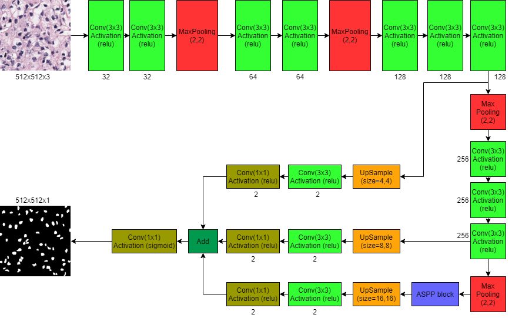

# SCPPnet

SCPPnet is the encoder-decoder architecture with separable convolution with pyramid pooling. This architecture is gone through convolution, maxpooling, aspp, and upsampling operation. The motivation of this algorithm is to segment the nuclei of H&E stained of Histhopathology Images. 

# Tools Required:- 
- TensorFlow 2.0 
- Keras 2.2
- NumPy 
- Matplotlib
- scikit-learn 

**Platform of Impletation is _Google Colab GPU_**
